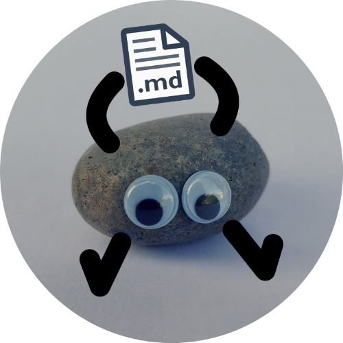

    
    <h1>pebbledoc</h1>
    
<b>Automatic documentation for small, well-rounded Python libraries</b>

**pebbledoc** automatically builds a single GitHub-flavored Markdown documentation file from the rst-docstrings of your small Python library. Ideal for tiny libraries for which a whole documentation website is simply overkill!

